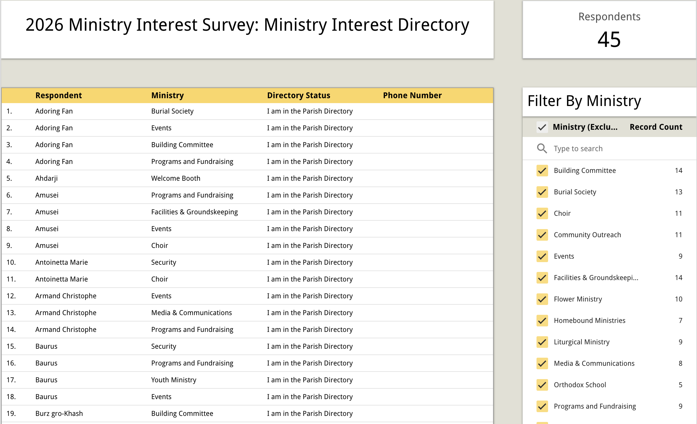
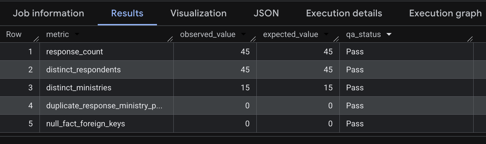
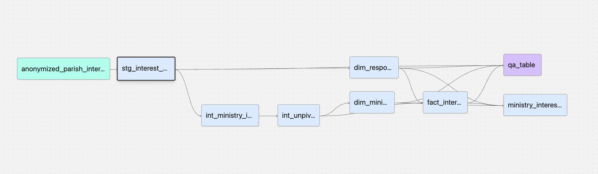

# Parish Interest Survey Analytics Pipeline

An end-to-end analytics-engineering project, which uses dbt and BigQuery to transform a parish ministry interest survey into a tested and documented dimensional model for ministry-interest analysis. This project built an end-user requested directory of interest in particular ministries as identified by respondents to the survey.
## Project Overview

Developer was asked to create a persistent directory of respondents and contact information according to their interest in particular volunteer ministries at an Eastern Orthodox parish. The data was originally collected in the form of a Google Forms survey and was provided to the developer as an `.xslx` file. The finished pipeline provides a directory in the form of a Looker dashboard which enables filtering by interest and person. This data can be consumed by clergy and ministry leaders for the purposes of outreach and recruitment for the particular ministries.

The source data included in this repository has been anonymized for public use, making use of non-playable character names from the Bethesda title *The Elder Scrolls IV: Oblivion*. Non-functional phone numbers were generated from randomly selected 6 digit integers.
## End Product



## Architecture

```
Anonymized Survey CSV
        ↓
     BigQuery
        ↓
   dbt Sources
        ↓
     Staging
        ↓
   Intermediate
        ↓
      Marts
   ↙         ↘
Dimensions   Fact
   ↘          ↙
Ministry Interest Report
        ↓
Looker Dashboard Directory
```

The anonymized source CSV is loaded into BigQuery with quoted newlines enabled before dbt transformations are executed. This was done to eliminate .csv file formatting breakdowns that presented fatal errors at the csv-parsing layer the developer could not directly edit. Such breakdowns were caused by the free-text survey responses allowing line breaks.


### Technology Stack


| Technology           | Role                                                 |
| -------------------- | ---------------------------------------------------- |
| BigQuery             | Data warehouse                                       |
| dbt Core             | Transformation, modeling, testing, and documentation |
| SQL                  | Data transformation and QA                           |
| Git / GitHub         | Version control and development workflow             |
| Looker Studio        | Visualized end-product for ministry consumption      |

## Data Modeling

The source grain coming from the Forms survey consisted of one record per response, with many ministries potentially being represented at time of response. In order to model the many-to-many response-ministry relationship, the responses needed to be unpivoted in order to accord a grain of one positive response-ministry per row. Developer formed two dimension tables, one for unique responses and another for unique ministries. The fact table associated positive interest in available ministries by response. This enables simple joins to produce the directory table in a report consumed by Looker.

### Source Grain

The source survey is modeled initially at one row per submitted response.

**Grain:** `one row per response`

### Staging Layer

The staging layer carries out minimal transformations, consisting only of renaming columns and generating a response identifier column. No grain transformations take place at this layer. This stage also implemented testing for unique and not null columns in full_name, response_id, and submitted_at columns.

### Intermediate Layer

Two major transformations occur here. First, a text checking function transforms the free response column ministry_interest into a boolean feature set of whether the respondent was interested in a ministry or not. Secondly, this wide feature set is unpivoted into a long collection of one response per positive ministry interest.

### Mart Layer


| Model           | Grain                                            | Purpose                                                                  |
| --------------- | ------------------------------------------------ | ------------------------------------------------------------------------ |
| `dim_responses` | One row per unique survey | Records each survey response and associated respondent information |
| `dim_ministry`  | One row per unique ministry                                 | Records all ministries available for selection in the original survey    |
| `fact_interest` | One row per expressed response–ministry interest | Records positive ministry-interest relationships for downstream analysis |


## Data Quality

Data quality was maintained via both dbt's schema testing suite and a custom Quality Assurance model built as a developer side reporting view.

### dbt Tests

Tests implemented include
- not_null
- unique
- relationships

dbt tests validate the following:

* uniqueness of primary/surrogate keys
* non-null required identifiers
* referential integrity between fact and dimensions


### QA Analysis

The project includes a QA analysis comparing observed model outputs against known structural expectations.

| Check                             | Expected |
| --------------------------------- | -------: |
| Source response count             |       45 |
| Distinct modeled responses        |       45 |
| Distinct ministries               |       15 |
| Duplicate response–ministry pairs |        0 |
| Null fact foreign keys            |        0 |

From BigQuery's query results:





## dbt Documentation

Model and column documentation is maintained alongside the dbt project using schema YAML files and reusable dbt documentation blocks. The schema YAML files contain column descriptions, or references to doc block entries in the case of repeated columns. These can be locally served as an HTML file through dbt's `dbt docs` command. 

Data lineage is documented through a DAG generated by dbt, as seen below.




## Repository Structure

```text
parish_interest_survey_portfolio/
├── analyses/
│   └── qa_table.sql
├── data/
├── docs/
│   └── images/
│       ├── dashboard.png
│       ├── dbt-lineage.png
│       └── qa-results.png
├── macros/
├── models/
│   ├── docs/
│   ├── staging/
│   ├── intermediate/
│   └── marts/
├── dbt_project.yml
├── packages.yml
└── README.md
```


## Running the Project
### Prerequisites

* Python
* dbt Core with the BigQuery adapter
* Access to a Google BigQuery project
* A configured dbt BigQuery profile

### 1. Clone the repository

```bash
git clone https://github.com/cadupee1464/parish_interest_survey_public.git
cd parish_interest_survey_public
```

### 2. Install dbt dependencies

```bash
dbt deps
```

### 3. Load the source data

Load the anonymized source CSV into BigQuery with **quoted newlines enabled**.

### 4. Validate the project

```bash
dbt debug
```

### 5. Build and test

```bash
dbt build
```

### 6. Generate documentation

```bash
dbt docs generate
dbt docs serve
```

## Development Workflow

<!--
Briefly explain your Git process.

Example:
"Development is performed on feature branches and integrated into main through
pull requests."

Mention this because it demonstrates workflow discipline, but don't turn the
README into a Git tutorial.
-->

Development is performed on feature branches and integrated into `main` through pull requests.

## CI/CD and Deployment Trade-offs

This project does not use warehouse-backed automated CI/CD. BigQuery access is configured through interactive multi-factor authentication, and the project is maintained by a single developer rather than a multi-contributor team.

Because of this, the added complexity of introducing a non-interactive service identity, secret management, and automated warehouse execution was not justified for this portfolio implementation.

Data integrity is instead validated through local `dbt build` / `dbt test` execution and an explicit QA analysis that checks known cardinalities, duplicate grain violations, and null foreign keys, as seen above.

In a production team environment, the natural next step would be to introduce a dedicated CI service identity and require automated dbt validation on pull requests before merge, which would conduct similar checks.


## Key Design Decisions

### Technology Stack Decisions

BigQuery and Looker Studio were chosen due to the parish's already extant use of Google services. Looker Studio's free tier accessibility was also desirable for the parish.

### Shape Transformation

The original survey responses were transformed into a wide boolean feature set which preserved original grain, but were not useful for dimensional modeling of ministry interest. An unpivot was necessary to associate the ministries as a particular dimension.

### Manual Ingestion

While the parish had already been operating on Google services, at this time a unique parish workspace had not been implemented, meaning data is passed around through the private accounts and spaces of volunteers. As such there is no secure space wherein automated ingestion could be hooked up without compromising data quality. Developer has raised data provenance and security concerns related to passing data around through email.

## Limitations and Future Improvements

Potential extensions for a production implementation include:

* Implementation of BigQuery SQL-based Machine Learning Algorithms. Such was an original scope discussion with stakeholder, but was bypassed for the sake of a faster project turn-over.
* Connection to more robust people analytics database, incorporating other data sources currently siloed by persons/ministries.
* Implementation of CI/CD workflows via GitHub.

## What This Project Demonstrates

This project demonstrates:

- dimensional modeling
- grain management
- dbt DAG design
- data quality/testing
- documentation
- Git workflow
- architectural trade-off reasoning

## Data Privacy
The source data included in this repository has been anonymized for public use, making use of non-playable character names from the Bethesda title *The Elder Scrolls IV: Oblivion*. Non-functional phone numbers were generated from randomly selected 6 digit integers.

